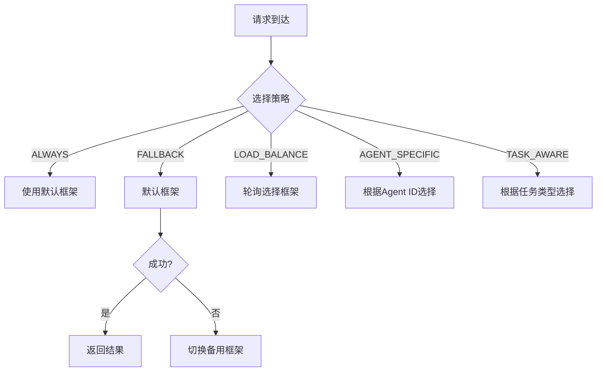

# LangChain4J + Spring AI 2.0 + Spring AI Alibaba 混合架构集成指南

## 概述

本项目采用**混合 AI 架构**，同时集成三个强大的 AI 框架：

- **LangChain4J**：轻量级、高性能，适合复杂 AI 工作流
- **Spring AI 2.0**：Spring 生态原生集成，适合企业级应用
- **Spring AI Alibaba**：国内大模型深度适配，支持阿里云 DashScope

### 核心优势

| 特性 | LangChain4J | Spring AI | Spring AI Alibaba |
|------|-------------|-----------|-------------------|
| **性能** | ⭐⭐⭐⭐⭐ | ⭐⭐⭐⭐ | ⭐⭐⭐⭐ |
| **生态集成** | ⭐⭐⭐ | ⭐⭐⭐⭐⭐ | ⭐⭐⭐⭐ |
| **国内支持** | ⭐⭐⭐ | ⭐⭐ | ⭐⭐⭐⭐⭐ |
| **功能丰富度** | ⭐⭐⭐⭐⭐ | ⭐⭐⭐⭐ | ⭐⭐⭐⭐ |
| **学习曲线** | ⭐⭐⭐ | ⭐⭐⭐⭐⭐ | ⭐⭐⭐⭐ |

---

## 架构设计

### 混合架构分层

```
┌─────────────────────────────────────────────────────────┐
│                 Agent Application Layer                │
│         (Drug Research, Medical, Financial, etc.)      │
└─────────────────────────────────────────────────────────┘
                          ↓
┌─────────────────────────────────────────────────────────┐
│              Hybrid AI Service Layer                    │
├─────────────────────────────────────────────────────────┤
│  ┌─────────────┐  ┌─────────────┐  ┌─────────────┐  │
│  │ HybridAI    │ │ HybridRAG   │ │ AIFramework │  │
│  │ Service     │ │ Service     │ │ Selector    │  │
│  │             │ │             │ │             │  │
│  │ 统一聊天接口  │ │ 混合 RAG     │ │ 智能选框架    │  │
│  └─────────────┘  └─────────────┘  └─────────────┘  │
├─────────────────────────────────────────────────────────┤
│              Performance & Monitoring                   │
│  ┌─────────────┐  ┌─────────────┐  ┌─────────────┐  │
│  │ AI Framework │ │ Metrics      │ │ Circuit     │  │
│  │ Metrics     │ │ Collector   │ │ Breaker     │  │
│  └─────────────┘  └─────────────┘  └─────────────┘  │
├─────────────────────────────────────────────────────────┤
│                 Framework Adapter Layer                 │
├─────────────────────────────────────────────────────────┤
│  ┌─────────────┐  ┌─────────────┐  ┌─────────────┐  │
│  │ LangChain4J │ │ Spring AI   │ │ Spring AI   │  │
│  │ Adapter     │ │ Adapter     │ │ Alibaba     │  │
│  │             │ │             │ │ Adapter     │  │
│  │ OpenAI,     │ │ OpenAI,     │ │ DashScope,  │  │
│  │ Anthropic,  │ │ DashScope,  │ │ 通义千问     │  │
│  │ Azure       │ │ Azure       │ │             │  │
│  └─────────────┘  └─────────────┘  └─────────────┘  │
├─────────────────────────────────────────────────────────┤
│                 Vector Store Layer                      │
├─────────────────────────────────────────────────────────┤
│  ┌─────────────┐  ┌─────────────┐  ┌─────────────┐  │
│  │ PostgreSQL   │ │ Milvus      │ │ Redis       │  │
│  │ + pgvector  │ │ (可选)      │ │ Cache       │  │
│  └─────────────┘  └─────────────┘  └─────────────┘  │
└─────────────────────────────────────────────────────────┘
```

### 框架选择策略



---

## 核心组件

### 1. AIFrameworkSelector

**功能**：智能框架选择器

**支持策略**：
- `ALWAYS`：始终使用默认框架
- `FALLBACK`：失败时降级到备用框架
- `LOAD_BALANCE`：负载均衡（按权重轮询）
- `AGENT_SPECIFIC`：根据 Agent 类型选择
- `TASK_AWARE`：根据任务类型智能选择

**使用示例**：

```java
@Autowired
private AIFrameworkSelector selector;

// 简单选择
AIFramework framework = selector.selectFramework();

// 根据 Agent 选择
AIFramework framework = selector.selectFramework("drug-research-agent");

// 根据任务选择
AIFramework framework = selector.selectFramework(
    "drug-research-agent",
    "compound_screening"
);

// 性能驱动选择
AIFramework framework = selector.selectBestFramework(metrics);

// 可靠性驱动选择
AIFramework framework = selector.selectMostReliableFramework(metrics);
```

### 2. HybridAIService

**功能**：统一的 AI 聊天服务

**使用示例**：

```java
@Autowired
private HybridAIService hybridAI;

// 简单聊天（自动选择框架）
String response = hybridAI.chat("你好");

// 带 Agent 上下文的聊天
String response = hybridAI.chat("drug-research-agent", "分析这个化合物");

// 带任务类型的聊天
String response = hybridAI.chat(
    "drug-research-agent",
    "compound_screening",
    "筛选具有抗肿瘤活性的化合物"
);

// 指定策略聊天
String response = hybridAI.chat(
    "medical-diagnosis-agent",
    "diagnosis",
    "患者症状分析",
    SelectStrategy.FALLBACK
);

// 并行聊天（取最快响应）
String response = hybridAI.chatParallel("快速回答这个问题");

// 聚合聊天（多框架答案）
String response = hybridAI.chatAggregate("这个问题需要深入分析", 2);

// 获取性能指标
FrameworkMetricsSummary metrics = hybridAI.getMetrics();
```

### 3. HybridRAGService

**功能**：混合 RAG 服务

**使用示例**：

```java
@Autowired
private HybridRAGService hybridRAG;

// 标准 RAG
String answer = hybridRAG.retrieveAndGenerate(
    "这个药物有什么副作用？",
    "drug-research-agent"
);

// 混合检索（多框架）
String answer = hybridRAG.hybridRetrieveAndGenerate(
    "分析药物的相互作用",
    "drug-research-agent",
    3  // 最少来源数
);

// 带验证的 RAG
String answer = hybridRAG.retrieveAndGenerateWithValidation(
    "该药物的临床试验结果如何？",
    "drug-research-agent"
);

// Agent 任务 RAG
String result = hybridRAG.executeAgentTaskWithRAG(
    "drug-research-agent",
    "compound_screening",
    "筛选符合标准的化合物",
    "search-compound, analyze-structure"
);

// 索引文档
hybridRAG.indexDocument(
    "drug-research-agent",
    "clinical_trial",
    "临床试验内容...",
    Map.of("trial_id", "TRIAL-001", "phase", "III")
);
```

### 4. AIFrameworkMetrics

**功能**：框架性能指标收集

**使用示例**：

```java
@Autowired
private AIFrameworkMetrics metrics;

// 记录请求
RequestContext context = metrics.recordRequestStart(AIFramework.SPRING_AI);

// 请求成功
metrics.recordRequestSuccess(context, promptTokens, completionTokens);

// 请求失败
metrics.recordRequestFailure(context, "Timeout");

// 获取指标
long totalRequests = metrics.getTotalRequests(AIFramework.SPRING_AI);
double successRate = metrics.getSuccessRate(AIFramework.SPRING_AI);
double avgResponseTime = metrics.getAverageResponseTime(AIFramework.SPRING_AI);

// 获取摘要
FrameworkMetricsSummary summary = metrics.getSummary();

// 重置指标
metrics.reset(AIFramework.SPRING_AI);
```

---

## 配置说明

### application-hybrid.yml

```yaml
agent:
  ai:
    # 默认框架
    default-framework: spring-ai

    # 切换策略
    switch-strategy: fallback

    # LangChain4J 配置
    langchain4j:
      enabled: true
      weight: 0.3  # 负载均衡权重
      openai:
        api-key: ${LANGCHAIN4J_OPENAI_API_KEY}
        model-name: gpt-4o-mini
        temperature: 0.7
        max-tokens: 2000

    # Spring AI 配置
    spring-ai:
      enabled: true
      provider: openai
      weight: 0.4

    # Spring AI Alibaba 配置
    spring-ai-alibaba:
      enabled: true
      model-name: qwen-plus
      weight: 0.3

    # Agent 特定配置
    agent-specific:
      framework-mapping:
        drug-research-agent: spring-ai
        medical-diagnosis-agent: spring-ai-alibaba
        agricultural-pest-agent: langchain4j

      task-mapping:
        chat: spring-ai
        retrieval: spring-ai-alibaba
        analysis: langchain4j

    # 监控配置
    monitoring:
      enabled: true
      performance-threshold: 5000
      circuit-breaker-threshold: 0.5
```

---

## 使用场景

### 场景 1：海外部署（OpenAI）

```yaml
agent:
  ai:
    default-framework: spring-ai
    switch-strategy: fallback
    spring-ai:
      enabled: true
      provider: openai
    spring-ai-alibaba:
      enabled: false  # 禁用国内服务
```

### 场景 2：国内部署（阿里云）

```yaml
agent:
  ai:
    default-framework: spring-ai-alibaba
    switch-strategy: fallback
    spring-ai:
      enabled: false  # 禁用 OpenAI
    spring-ai-alibaba:
      enabled: true
      model-name: qwen-plus
```

### 场景 3：Agent 专用框架

```yaml
agent:
  ai:
    switch-strategy: agent-specific
    agent-specific:
      framework-mapping:
        drug-research-agent: spring-ai          # 药物研发用 Spring AI
        medical-diagnosis-agent: spring-ai-alibaba  # 医疗诊断用阿里云
        financial-pricing-agent: langchain4j     # 金融定价用 LangChain4J
```

### 场景 4：任务感知切换

```yaml
agent:
  ai:
    switch-strategy: task-aware
    agent-specific:
      task-mapping:
        chat: spring-ai              # 聊天用 Spring AI
        retrieval: spring-ai-alibaba # 检索用阿里云（更快）
        analysis: langchain4j        # 分析用 LangChain4J（更灵活）
        generation: spring-ai       # 生成用 Spring AI
        translation: spring-ai-alibaba # 翻译用阿里云
```

### 场景 5：负载均衡

```yaml
agent:
  ai:
    switch-strategy: load-balance
    langchain4j:
      weight: 0.3    # 30% 流量
    spring-ai:
      weight: 0.4    # 40% 流量
    spring-ai-alibaba:
      weight: 0.3    # 30% 流量
```

---

## 性能优化

### 1. 框架权重优化

```java
// 根据实际性能调整权重
HybridAIProperties properties = hybridAIService.getProperties();

// 如果 Spring AI 性能最好，增加权重
properties.getSpringAI().setWeight(0.6);
properties.getLangchain4j().setWeight(0.2);
properties.getSpringAIAlibaba().setWeight(0.2);
```

### 2. 智能框架选择

```java
@Service
public class SmartFrameworkService {

    @Autowired
    private AIFrameworkSelector selector;

    @Autowired
    private AIFrameworkMetrics metrics;

    public AIFramework selectOptimalFramework(String taskType) {
        // 根据任务类型选择
        if (taskType.equals("fast_retrieval")) {
            // 快速检索：选择最快的框架
            return selector.selectBestFramework(metrics);
        } else if (taskType.equals("complex_analysis")) {
            // 复杂分析：选择最可靠的框架
            return selector.selectMostReliableFramework(metrics);
        } else {
            // 默认：负载均衡
            return selector.selectFramework();
        }
    }
}
```

### 3. 并行处理

```java
public String parallelQuery(String question) {
    // 并行调用所有框架
    List<String> responses = Arrays.asList(
        hybridAI.chatWithFramework(LANGCHAIN4J, question),
        hybridAI.chatWithFramework(SPRING_AI, question),
        hybridAI.chatWithFramework(SPRING_AI_ALIBABA, question)
    );

    // 返回最快完成的响应
    return responses.get(0);
}
```

### 4. 缓存策略

```java
@Service
@CacheConfig(cacheNames = "ai-responses")
public class CachedHybridAIService {

    @Cacheable(key = "#question.hashCode()")
    public String chatWithCache(String question) {
        return hybridAI.chat(question);
    }

    @CacheEvict(allEntries = true)
    public void clearCache() {
        log.info("Cache cleared");
    }
}
```

---

## 监控与运维

### 1. 性能指标监控

```java
@RestController
@RequestMapping("/api/ai/metrics")
public class AIMetricsController {

    @Autowired
    private AIFrameworkMetrics metrics;

    @GetMapping("/summary")
    public FrameworkMetricsSummary getMetrics() {
        return metrics.getSummary();
    }

    @GetMapping("/framework/{framework}")
    public FrameworkMetrics getFrameworkMetrics(
            @PathVariable AIFramework framework) {
        return FrameworkMetrics.builder()
                .framework(framework)
                .totalRequests(metrics.getTotalRequests(framework))
                .successRate(metrics.getSuccessRate(framework))
                .averageResponseTime(metrics.getAverageResponseTime(framework))
                .build();
    }
}
```

### 2. Prometheus 集成

```yaml
# application.yml
management:
  endpoints:
    web:
      exposure:
        include: metrics
  metrics:
    export:
      prometheus:
        enabled: true
```

```java
@Component
public class AIPrometheusMetrics {

    private final Counter requestCounter;
    private final Timer responseTimer;

    public AIPrometheusMetrics(MeterRegistry registry) {
        this.requestCounter = Counter.builder("ai_requests_total")
                .tag("framework", "")
                .register(registry);

        this.responseTimer = Timer.builder("ai_response_seconds")
                .tag("framework", "")
                .register(registry);
    }

    public void recordRequest(AIFramework framework, long durationMs) {
        requestCounter.increment(Tags.of("framework", framework.getCode()));
        responseTimer.record(durationMs / 1000.0, TimeUnit.SECONDS);
    }
}
```

### 3. 熔断器配置

```java
@Configuration
public class CircuitBreakerConfig {

    @Bean
    public CircuitBreaker aiCircuitBreaker(HybridAIProperties properties) {
        return CircuitBreaker.builder("ai-service")
                .failureRateThreshold(
                        properties.getMonitoring().getCircuitBreakerThreshold() * 100)
                .slidingWindowSize(100)
                .waitDurationInOpenState(Duration.ofSeconds(60))
                .permittedNumberOfCallsInHalfOpenState(
                        properties.getMonitoring().getCircuitBreakerHalfOpenRequests())
                .build();
    }
}
```

---

## 故障排除

### 问题 1：框架切换频繁

**原因**：默认框架经常失败，频繁降级

**解决方案**：

```yaml
agent:
  ai:
    switch-strategy: load-balance  # 改为负载均衡
    monitoring:
      circuit-breaker-threshold: 0.8  # 提高熔断阈值
```

### 问题 2：响应时间过长

**原因**：某个框架性能差

**解决方案**：

```java
// 查看性能指标
FrameworkMetricsSummary summary = metrics.getSummary();

// 根据性能调整权重
summary.getMetrics().forEach((framework, metrics) -> {
    if (metrics.getAverageResponseTime() > 5000) {
        framework.setWeight(framework.getWeight() * 0.5);  // 降低权重
    }
});
```

### 问题 3：Token 使用量过高

**原因**：多个框架重复调用

**解决方案**：

```java
// 使用缓存减少重复调用
@Cacheable(key = "#question.hashCode()")
public String cachedChat(String question) {
    return hybridAI.chat(question);
}
```

---

## 最佳实践

### 1. 框架选择建议

| 场景 | 推荐框架 | 理由 |
|------|----------|------|
| **海外部署** | Spring AI (OpenAI) | 稳定、生态完善 |
| **国内部署** | Spring AI Alibaba | 低延迟、合规 |
| **复杂工作流** | LangChain4J | 灵活、功能丰富 |
| **简单聊天** | Spring AI | 开箱即用 |
| **性能敏感** | 负载均衡模式 | 高可用 |
| **关键业务** | 双框架验证 | 可靠性 |

### 2. 配置建议

```yaml
# 生产环境推荐配置
agent:
  ai:
    switch-strategy: fallback  # 推荐降级模式
    langchain4j:
      enabled: true
      weight: 0.2  # LangChain4J 作为备用
    spring-ai:
      enabled: true
      weight: 0.5  # Spring AI 作为主框架
    spring-ai-alibaba:
      enabled: true
      weight: 0.3  # 阿里云作为备用
    monitoring:
      enabled: true
      performance-threshold: 3000
      circuit-breaker-threshold: 0.6
```

### 3. 监控建议

- **实时监控**：请求成功率、响应时间、Token 使用量
- **告警规则**：成功率 < 90%、响应时间 > 5s、错误率 > 10%
- **性能优化**：每周分析指标，调整框架权重

---

## 参考资源

- [LangChain4J 文档](https://docs.langchain4j.dev/)
- [Spring AI 文档](https://docs.spring.io/spring-ai/reference/)
- [Spring AI Alibaba 文档](https://sca.aliyun.com/ai/)
- [pgvector 文档](https://github.com/pgvector/pgvector)

---

## License

MIT License
